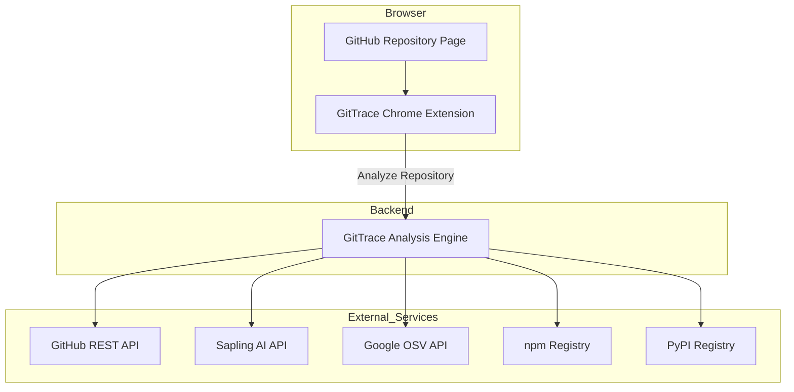

# GitTrace

> AI-Powered GitHub Repository Intelligence for Developers


> **🚧 Project Status**
>
> GitTrace is currently under active development and is being improved continuously. New features, security checks, compatibility analysis modules, and UI enhancements are added regularly. The roadmap below reflects ongoing development progress.

---

## Overview

GitTrace is a Chrome Extension that analyzes GitHub repositories to detect AI-generated code, identify license risks, surface security vulnerabilities, and evaluate system compatibility.

Instead of manually inspecting repositories, GitTrace injects live repository intelligence directly into GitHub and provides a detailed analysis report in real time.

---

## Key Capabilities

✅ AI-Generated Code Detection

✅ License Risk Assessment

✅ Security Vulnerability Scanning

✅ Secret Detection

✅ Phantom Package Detection

✅ Commit Pattern Analysis

✅ File-Level AI Heatmaps

✅ Repository Compatibility Checks

✅ GitHub Native UI Integration

---

## Table of Contents

* Overview
* Key Capabilities
* Architecture
* Project Structure
* Technology Stack
* Features

  * AI Detection
  * Commit Velocity Analysis
  * License Compliance
  * Security Shield
  * File Tree Heatmap
  * Chrome Extension UI
* Development Roadmap
* Getting Started
* API Reference
* Environment Variables
* License

---

## Architecture



---

## Project Structure

```text
gittrace/
├── extension/
│   ├── manifest.json
│   ├── icons/
│   └── src/
│       ├── content.js
│       ├── background.js
│       ├── badge.js
│       ├── heatmap.js
│       ├── api.js
│       └── test-connection.js
│
├── backend/
│   ├── src/
│   │   ├── server.js
│   │   ├── config.js
│   │   ├── routes/
│   │   ├── services/
│   │   └── middleware/
│   └── .env.example
│
└── shared/
```

---

## Technology Stack

### Frontend Extension

[](https://github.com/syvixor/skills-icons)

- Vanilla JavaScript (ES Modules)
- HTML5
- CSS3
- Chrome Extension Manifest V3
- Shadow DOM
- MutationObserver
- chrome.storage.session

---

### Backend

[](https://github.com/syvixor/skills-icons)

- Node.js
- Express.js
- Axios
- node-fetch
- Helmet
- CORS
- Express Rate Limit
- Morgan
- Dotenv

---

### APIs & Services

[](https://github.com/syvixor/skills-icons)

- GitHub REST API
- Google OSV API
- npm Registry
- PyPI Registry
- Sapling AI API

---

### Development Tools

[](https://github.com/syvixor/skills-icons)

- Git
- GitHub
- VS Code
### External Services

| Service         | Purpose              |
| --------------- | -------------------- |
| GitHub REST API | Repository analysis  |
| Sapling AI      | AI detection         |
| Google OSV      | CVE scanning         |
| npm Registry    | Package verification |
| PyPI Registry   | Package verification |

---

# Features

## AI Detection Engine

### Capabilities

* Per-file AI probability scoring
* Large file chunking support
* Heuristic score boosting
* Human signal detection
* Weighted repository scoring
* Confidence labels

### Risk Labels

| Score  | Label     |
| ------ | --------- |
| 0–30   | Low       |
| 31–60  | Medium    |
| 61–80  | High      |
| 81–100 | Very High |

---

## Commit Velocity Analysis

* Large first commit detection
* Bulk commit detection
* Rewrite pattern detection
* Generic commit message detection
* Single-author bulk activity detection

---

## License Compliance Engine

### Supported

* MIT
* Apache 2.0
* GPL-2.0
* GPL-3.0
* AGPL
* LGPL
* MPL
* EPL

and 25 total SPDX licenses.

### Risk Levels

| Level     | Meaning                         |
| --------- | ------------------------------- |
| SAFE      | Safe for commercial usage       |
| REVIEW    | Legal review recommended        |
| HIGH_RISK | Significant restrictions        |
| UNKNOWN   | License could not be determined |

---

## Security Shield

### CVE Scanner

* Google OSV integration
* npm packages
* PyPI packages
* Go modules
* Rust crates
* RubyGems

### Phantom Package Detection

Detects potentially hallucinated dependencies.

### Secret Scanner

Supports 25+ secret patterns including:

* AWS Keys
* GitHub Tokens
* Stripe Keys
* JWT Secrets
* Database URLs
* Private Keys

---

## File Tree Heatmap

Visual AI risk indicators directly inside GitHub's file tree.

| Risk     | Color  |
| -------- | ------ |
| Low      | Green  |
| Medium   | Amber  |
| High     | Orange |
| Critical | Red    |

---

## Chrome Extension Interface

### Repository Badge

* Live repository score
* Animated SVG ring
* One-click scan refresh

### Analysis Dashboard

Tabs:

1. Score
2. Breakdown
3. Security
4. Compatibility

### UX Features

* Shadow DOM isolation
* Loading skeletons
* Error states
* SPA navigation support
* Session cache

---

# Development Roadmap

| Day    | Status         | Module                     |
| ------ | -------------- | -------------------------- |
| Day 1  | ✅ Complete     | Extension Scaffold         |
| Day 2  | ✅ Complete     | Badge UI                   |
| Day 3  | ✅ Complete     | Backend Foundation         |
| Day 4  | ✅ Complete     | AI Detection Engine        |
| Day 5  | ✅ Complete     | Backend ↔ Extension Wiring |
| Day 6  | ✅ Complete     | Heatmap & License          |
| Day 7  | ✅ Complete     | Security Shield            |
| Day 8  | 🔄 In Progress | System Compatibility       |
| Day 9  | Planned        | PR Inline Shield           |
| Day 10 | Planned        | Hardening & Deployment     |

---

## Future Enhancements

* Pull Request AI Review
* Contributor Trust Scores
* Dependency Health Metrics
* Historical Repository Tracking
* Enterprise Dashboard
* Team Analytics

---

## Getting Started

Follow the setup instructions below to run GitTrace locally.

### Clone Repository

```bash
git clone https://github.com/YOUR_USERNAME/gittrace.git
cd gittrace
```

### Backend Setup

```bash
cd backend
npm install
cp .env.example .env
npm run dev
```

### Extension Setup

1. Open `chrome://extensions`
2. Enable Developer Mode
3. Click **Load unpacked**
4. Select `gittrace/extension`

---

## API Reference

### POST /api/analyze

Analyzes a GitHub repository.

### GET /health

Returns server status and uptime.

### DELETE /api/analyze/cache

Clears analysis cache.

---

## Environment Variables

| Variable        | Required |
| --------------- | -------- |
| GITHUB_TOKEN    | Yes      |
| AI_API_KEY      | Yes      |
| GITTRACE_SECRET | Yes      |
| PORT            | Optional |
| NODE_ENV        | Optional |
| AI_DEMO_MODE    | Optional |

---

## License

MIT License.

See the LICENSE file for details.
